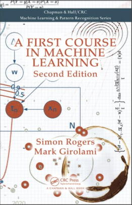

    

    

        

            
        

        

        <h3> First Course in Machine Learning Textbook</h3>
        <h5> by Mark Girolami and Simon Rogers</h5>
        

    

  

  

    <!-- <h5 class="card-title">Special title treatment</h5>
    
With supporting text below as a natural lead-in to additional content.
 -->
    <a href="https://github.com/csml-cam/fcmlcode" class="btn btn-primary">Code examples on GitHub</a>
    <a href="https://www.routledge.com/A-First-Course-in-Machine-Learning-Second-Edition/Rogers-Girolami/p/book/9781498738484" class="btn btn-primary">Publisher's page</a>
    <a href="https://www.amazon.co.uk/Course-Machine-Learning-Pattern-Recognition/dp/1498738486" class="btn btn-primary">Buy on Amazon UK</a>
    <a href="https://www.amazon.com/First-Course-Machine-Learning-Second/dp/1498738486" class="btn btn-primary">Buy on Amazon US</a>

  

